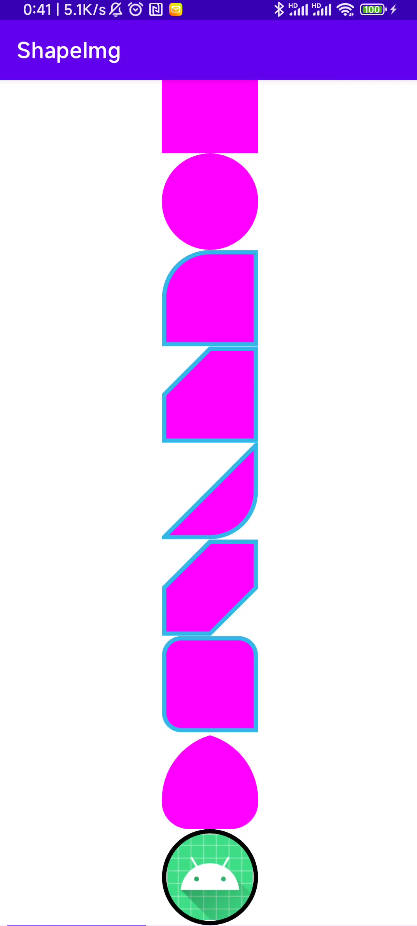

# ShapeImageView

# 自定义形状、描边、圆角、切角的ImageView



#### 使用

```
maven { url "https://www.jitpack.io" }
```

依赖于google的**material**库

```
implementation 'com.google.android.material:material:1.6.1'
implementation 'com.gitee.mahongyin:ShapeImageView:1.0.0'
```

#### 属性  

```xml
    原有
    <attr name="strokeWidth" />
    <attr name="strokeColor" />
   x <attr name="shapeAppearance" />
   x <attr name="shapeAppearanceOverlay" />
    <attr name="contentPadding" />
    <attr name="contentPaddingBottom" />
    <attr name="contentPaddingEnd" format="dimension" />
    <attr name="contentPaddingLeft" />
    <attr name="contentPaddingRight" />
    <attr name="contentPaddingStart" format="dimension" />
    <attr name="contentPaddingTop" />

    增加
    <attr name="shape_TopLeft" format="enum">
    <attr name="shape_TopRight" format="enum">
    <attr name="shape_BottomRight" format="enum">
    <attr name="shape_BottomLeft" format="enum">
    <attr name="shape_All" format="enum">

    <attr name="shape_corner_TopLeft" format="dimension|fraction" />
    <attr name="shape_corner_TopRight" format="dimension|fraction" />
    <attr name="shape_corner_BottomLeft" format="dimension|fraction" />
    <attr name="shape_corner_BottomRight" format="dimension|fraction" />
    <attr name="shape_corner_All" format="dimension|fraction" />
```

(shape_?)形状两种类型:rounded\cut

(shape_corner_?)形状角的大小

属性搭配使用即可创建自己所需的样式

#### xml布局

```xml
        <com.mhy.shape_imageview.ShapeImageView
            android:layout_width="90dp"
            android:layout_height="90dp"
            android:src="#ff00ff"
            app:shape_All="rounded"
            app:shape_corner_All="50%"
            app:strokeColor="@android:color/holo_blue_light"
            app:strokeWidth="4dp"
            android:padding="2dp"/>
```


#### 注意

```
指定strokeWidth描边的时候，其描边会被覆盖掉一半，如strokeWidth=4dp，上下左右会被覆盖，实际的效果是只有2dp被显示(画笔一半)
 * 描边问题处理方法:
 * app:strokeWidth="4dp"
 * android:padding="2dp"
```

